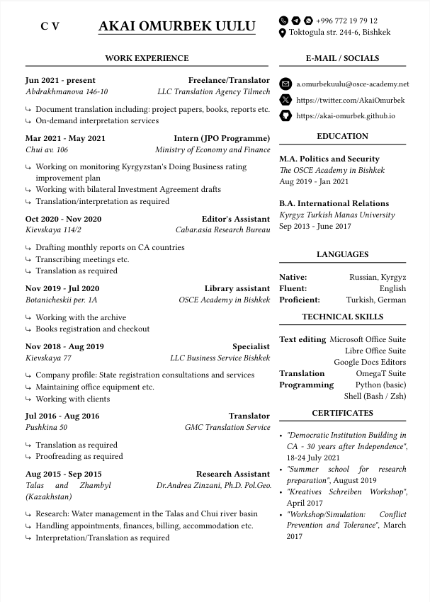

# Simple one-page CV using [Typst](https://github.com/typst/typst)



Hi, everyone! This is my take on a reproducible CV powered by Typst. This one is very, ***very*** raw. I have to work on it a bit more in the future. The layout is optimal for one page (the main / sidebar separation) - otherwise it might look shabby. [Click here](cv.pdf) to take a look at the example pdf.

## Usage 

1. Clone the repository:
```sh
git clone https://github.com/akai-omurbek/Typst-CV
cd Typst-CV 
```
2. Change the `YAML` file `cv_info.yml` - that one is pretty straightforward
3. Compile your CV:
```sh
typst compile cv.typ
```
4. Open `cv.pdf` file with a reader of your choice.

